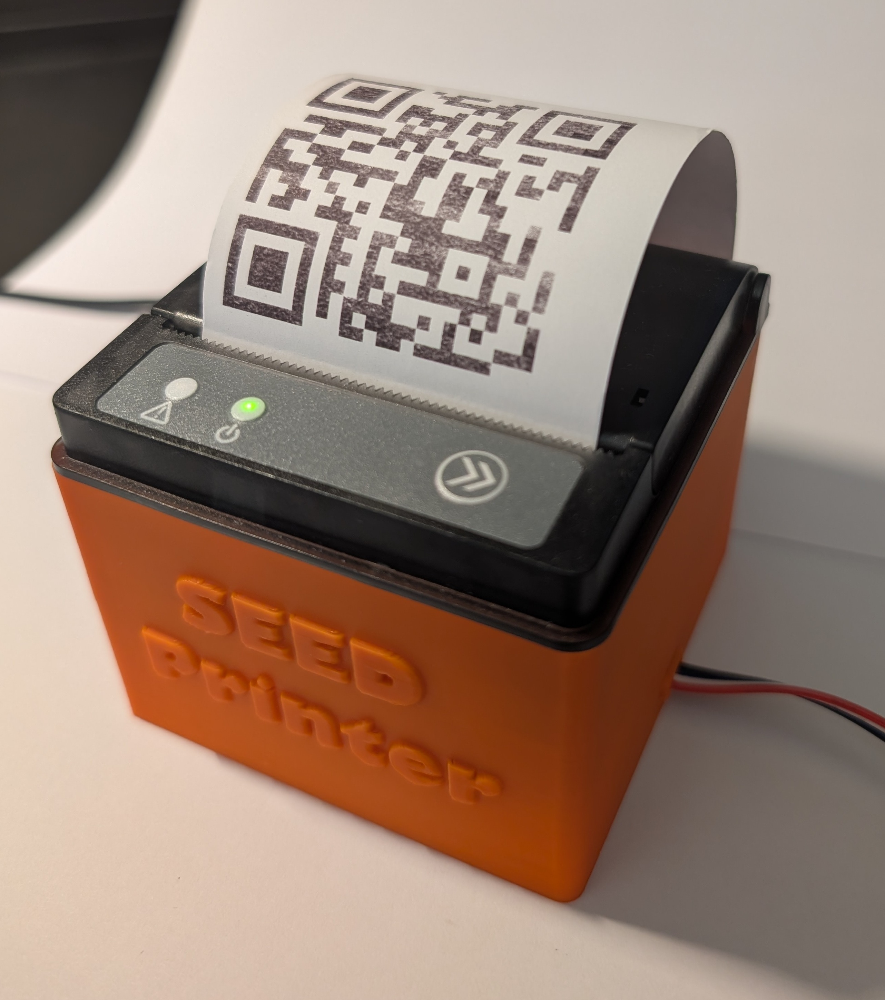
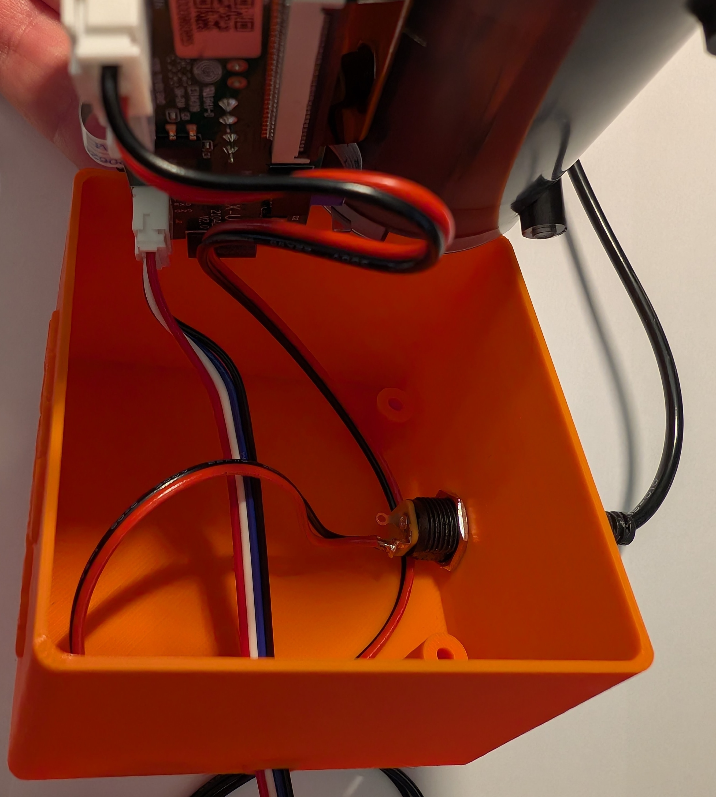

# Krux Thermal Printer Enclosure

A 3D-printed enclosure for the **Goojprt Qr203 58mm thermal printer**. Designed in FreeCAD for use with [Krux](https://github.com/selfcustody/krux) running on K210 modules, but compatible with any application that uses this printer.

The printer ships barebones with no mounting base — this design provides a sturdy enclosure with integrated cable management.

---

## Photos

---

## Design Files

| File | Format | Description |
|------|--------|-------------|
| `Enclosure_CableHole.FCStd` | FreeCAD | Source file for the enclosure |
| `ThermalPrinter-Print.3mf` | 3MF | Ready-to-print enclosure with cable hole |

---

## Hardware Requirements

- [Goojprt Qr203 58mm thermal printer](https://www.aliexpress.com/item/1005005979403268.html)
- [DC power jack](https://www.aliexpress.com/item/33024078552.html)
- M3 × 16mm or M3 × 18mm countersunk screws
- TTL cable for data connection

---

## Printing

Load `ThermalPrinter-Print.3mf` into your preferred slicer and print as-is. No special supports or settings are required.

---

## Wiring & Setup

For wiring the thermal printer to a K210 module running Krux, refer to the official Krux discussion:

- [Thermal Printer — Krux Discussion #312](https://github.com/selfcustody/krux/discussions/312)

---

## License

This work is licensed under [CC BY-SA 4.0](https://creativecommons.org/licenses/by-sa/4.0/). If you remix, transform, or build upon this design, you must distribute your contributions under the [same license](https://creativecommons.org/licenses/by-sa/4.0/).

